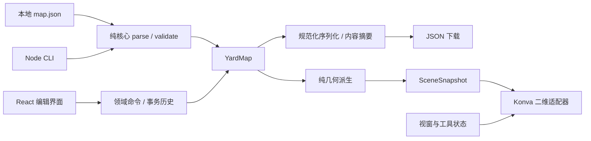

# M0 架构决策记录

日期：2026-09-09。范围：M0 契约、M1 二维基础编辑与 JSON 往返。本文记录设计决策；实际检查结果与阶段裁决由阶段报告记录。

## 现有工作与兼容方案

开发前读取了工作区、`paper01`、`paper01/map` 的 AGENTS 规则，以及 PRODUCT_SPEC、IMPLEMENTATION_PLAN、ACCEPTANCE_TESTS。`paper01` 是 Git 仓库；`map` 原有需求文档，没有可复用的应用代码。新增工程只写入 `map`，不改动原有需求文档、论文工作和 `data/raw`。保留原有文件名，阶段专属文档和例图使用 M0/M1 前缀。

用户本次批准的 M0+M1 方案是实施边界：A07 的最小复制和 A29 的基础冲突保护在 M1 落地；M2 中更完整的编辑、资产及持久化能力继续保留。产品文档描述的完整首版包括后续里程碑，不能据此把 M2—M5 提前计入 M1 完成项。

## 决策

| 编号 | 决策与理由 | 后果 |
|---|---|---|
| ADR-01 | YardMap JSON 是主数据；Schema 和语义验证共同定义可接收文档 | 不导出 Konva 场景树；外部手改与界面导入共用解析、验证和派生路径 |
| ADR-02 | npm、TypeScript strict、React、Vite、Konva/react-konva；单仓库模块化应用 | 不加服务端、云数据库、遥测或第二套渲染器；准确版本见 package.json 与 package-lock.json，只有实际检查后才标已验证 |
| ADR-03 | domain、geometry、validation 等核心只依赖纯 TypeScript/JSON 库 | 单独 Node 类型检查与依赖边界检查；浏览器和 CLI 调用同一核心，不用 DOM mock 证明纯核心 |
| ADR-04 | 本地米制右手坐标，XY 为地面、Z 向上，角度 rad、质量 kg、时间 s | 屏幕 Y 翻转、像素比例和平移只属于二维适配器；Z=0 是本地基面，不表示测得海拔 |
| ADR-05 | 节点位置与道路内部折点唯一决定中心线；长度按 XY 水平折线派生 | 不保存可编辑长度、画布 transform 或路由缓存副本；改变高程不会被误当作二维长度变化 |
| ADR-06 | ID 与名称分离；连接只能由显式引用表达 | 几何相交不自动接通；入口不由设施中心或面积生成；复制要原子重映射 ID |
| ADR-07 | Draft 2020-12 Schema、schemaVersion 0.1.0、严格核心字段与声明的扩展命名空间 | 未来版本拒绝；未知字段报错；不支持的扩展行为完整保留并阻止相关能力，不能降级后导出 |
| ADR-08 | 规范化 JSON 递归按对象键排序、保留数组顺序、不做坐标舍入；摘要使用 SHA-256 | UTF-8、两空格、LF；摘要排除 revision，但包含所有其余声明字段；来源或资产引用变化也使摘要变化 |
| ADR-09 | 所有业务修改通过可验证事务；撤销/重做恢复事务前后完整状态 | 拖动中间帧仅预览，结束一次提交；失败事务不改地图和历史；视窗与选择不进入领域数据 |
| ADR-10 | 文件选择导入与下载为跨浏览器基线；以内容摘要作为保存/重载比较依据 | 不假设浏览器能监听磁盘；重新导入先验证候选，再让用户处理未保存编辑；默认取消冲突 |
| ADR-11 | 包含当前未支持设施、资源、底图或行为扩展的文档整图只读检查 | 完整保留合法数据，可查看现有矢量节点/道路；明确列出未渲染、未验证的能力，不能宣称已支持高级实体编辑 |
| ADR-12 | 实际交付 SceneSnapshot 与二维渲染；SimulationAdapter、未来渲染只有契约和消息夹具 | 不提供空函数假装支持调度、三维或 VR；网络编译与路径预览等后续能力明确 unsupported |

## 模块与文件角色

静态 `map.json` 包含全部语义几何。独立 `scenario.json` 记录任务、车辆、时间规则与假设；运行日志/回放绑定地图摘要；`editor-state.json` 记录视窗等编辑状态；二进制资产通过 `assets/` 相对路径引用。M1 实现地图文件的读取与下载，视窗状态只在编辑器内持有；不宣称已实现 scenario、回放、editor-state 文件导入导出或 ZIP。缺少底图不能导致已存矢量几何丢失。

## 校验边界与未决信息

M1 的 `draft` 校验检查语法、Schema、稳定 ID、跨实体引用和基础几何硬约束；缺失物理参数和未实现能力通过结构化问题报告。草稿可保存未完成但结构有效的模型。非法 JSON、悬空引用等不能替换当前有效编辑文档。`topology_preview`、`level2_network`、`swept_geometry` 在 M1 均为 unsupported。

未决的是现场输入，不是隐含软件默认值：真实来源、道路宽高/承载、方向、转向规则、资源控制模型、设施服务入口和测绘精度，需要用户提供或后续显式假设配置。新建地图标 synthetic，未知物理值保持 unknown；不填 40m 道路，不默认整路口容量 1。草稿验证通过不表示真实船厂可行或运输安全。

M2 才处理底图标定、设施/资源的完整人工编辑、拆分/合并、ZIP 与恢复；M3 才处理路由编译、发布配置和网络路径预览。M4/M5 的外部运行集成、三维、VR 不属于本次交付。

## 版本与迁移

0.1.0 是首个本地契约，没有历史版本迁移器。M1 遇到其他 schemaVersion 拒绝导入并保留当前文档。后续 Schema 变更必须同步生成类型、文档、示例与回归；需要迁移时显式保留原件、输出差异，不通过删字段方式兼容。包版本与依赖锁文件、Schema 版本和文档 revision 是三种不同版本。
